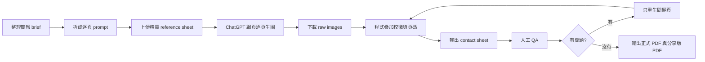

# AI 簡報製作工作流：成功經驗與擴散規劃

本文件整理 `AI 行政工作台` 簡報製作過程中已驗證可行的做法，並規劃如何把這套工作流分享給校內行政同仁、跨處室專案與未來研習課程使用。

## 這次真正成功的地方

這次成功不只是產出一份正式簡報，而是把「全頁生圖簡報」拆成一條可控、可檢核、可重複的流程：

1. 內容先結構化，再開始生圖。
   - 先整理提案目的、採購標的、案例清單、附錄案例與敏感內容邊界。
   - 每張投影片都有明確任務，不讓生圖工具自由發散。

2. 可變元素交給 ChatGPT，不可變元素交給程式。
   - ChatGPT 負責情境化畫面、行政流程、表格與場景。
   - 校徽與頁碼由本機程式後製，避免校徽漂移、變形、頁碼大小不一。

3. 品牌識別從「生成」改成「約束」。
   - 四精靈只作為小型輔助角色，可選擇 0-4 隻。
   - 精靈不能反客為主，不能遮住流程、數據、標題或案例重點。
   - 校徽不讓 ChatGPT 畫，固定疊在右上角。

4. 逐頁單張生成，比一次多圖更穩定。
   - 多圖生成適合 MVP 測試，但正式簡報仍以逐頁生成較可控。
   - 逐頁可以針對錯誤頁重生，不必整份重來。

5. 用 contact sheet 做人工總覽檢查。
   - 先看整份節奏、頁碼、校徽、版面與品牌是否一致。
   - 再針對有問題的單頁做局部重生。

6. Prompt 規則集中管理。
   - 品牌不反客為主、左下頁碼留白、右上校徽留白、案例頁必須標示「案例」、API 要畫進流程等規則，都應列入全域規則。
   - 單頁 prompt 只負責該頁內容，不重複承擔整份簡報的規範。

## 已驗證的標準流程

## 工作流的關鍵設計原則

### 1. 先寫 proposal，再做漂亮

生圖簡報最容易失敗的地方，是一開始就追求漂亮。正式提案應先確認：

- 這張投影片要說服誰
- 要留下哪一句話
- 需要哪個案例或證據
- 哪些文字不能出錯
- 哪些敏感內容不能出現

畫面風格是在這些條件成立後才處理。

### 2. 讓 AI 畫「意象」，不要畫「正式識別」

ChatGPT Images 適合畫：

- 行政辦公桌
- 資料夾與表格
- 流程圖
- 場租行事曆
- 檢核表
- 工作台情境

但不適合直接負責：

- 校徽
- 頁碼
- 統一品牌位置
- 必須精準一致的 logo
- 每頁完全一致的版面元件

這些應由程式後製。

### 3. 安全角落要在生圖前預留

正式規格：

- 右上角：固定放校徽
- 左下角：固定放頁碼

因此 prompt 必須先要求：

- 右上角不要放標題、圖示、角色、表格、數據或重要物件
- 左下角不要放標題、圖示、角色、表格、數據或重要物件

不要等到輸出後才硬壓上去。

### 4. 精靈是品牌點綴，不是主角

精靈適合用在：

- 邊角小動作
- 指向流程
- 拿著小型文件或放大鏡
- 輕微增加學校識別感

精靈不適合：

- 站滿畫面中央
- 比案例圖表更醒目
- 擋住文字
- 變成可愛海報主題
- 被改造成新角色或多出手腳、翅膀、尾巴

## 分享擴散的三層設計

### 第一層：展示成果，降低理解門檻

對象：校長、主任、組長、行政同仁。

形式：

- 用本次 `AI 行政工作台` 簡報作為成品展示。
- 說明這不是單純「請 AI 畫圖」，而是「把提案、案例、流程、品牌與輸出串成可追蹤工作流」。
- 展示 final PDF、contact sheet、prompt、raw image、overlay image 的關係。

重點訊息：

- 行政資料先整理，AI 才能穩定產出。
- 圖片只是結果，真正有價值的是流程。
- 有問題的頁面可以只重生該頁，成本可控。

### 第二層：示範流程，讓承辦人看得懂

對象：有意願嘗試的行政承辦人、資訊組、課程組、總務處或文書相關人員。

建議示範 45-60 分鐘：

1. 展示簡報 brief 如何變成投影片架構。
2. 展示一張 prompt 如何寫出案例頁。
3. 示範上傳精靈 reference sheet。
4. 示範 ChatGPT 網頁逐頁生圖。
5. 示範程式疊加校徽與頁碼。
6. 示範 contact sheet 如何檢查整份簡報。
7. 示範如何只重生錯誤頁。

這一層不要求每個人都會寫程式，只要讓大家知道「流程可被拆開、檢查、修正」。

### 第三層：建立模板包，讓未來可複製

對象：未來要製作成果簡報、採購提案、研習簡報、行政專案簡報的人。

應整理成一個可複製模板包：

- `brief-template.md`
- `slide-outline-template.md`
- `deck-wide-rules.md`
- `single-slide-prompt-template.md`
- `brand-reference-guide.md`
- `qa-checklist.md`
- `overlay-command-template.md`
- `export-pdf-command-template.md`

目標是讓下一個主題不必重學整條線，只要替換：

- 主題
- 受眾
- 案例
- 品牌素材
- 投影片張數
- 最終輸出檔名

## 建議的校內分享主題

### 研習主題 A：從行政成果到提案簡報

適合行政會議或小型工作坊。

主軸：

- 如何把零散成果整理成簡報 brief
- 如何把案例轉成視覺化流程
- 如何避免 AI 生成漂亮但不準確的內容

### 研習主題 B：品牌識別與 AI 生圖的分工

適合已有校徽、吉祥物或活動識別的專案。

主軸：

- 哪些元素交給 AI
- 哪些元素要程式後製
- 為什麼校徽與頁碼不該讓 AI 自由生成

### 研習主題 C：行政簡報的 QA 與重生策略

適合承辦人實作。

主軸：

- contact sheet 總覽檢查
- 單頁問題分類
- 何時改 prompt
- 何時只靠後製
- 何時必須重生

## 推廣時可以使用的說法

對校內行政同仁：

> 這套流程不是要大家都變成設計師，而是把行政經驗整理成可重複使用的簡報生產線。

對採購或預算審查：

> 本次採購的價值不只是一個 AI 帳號，而是用低成本建立可累積、可交接、可展示的行政工作流程。

對未來想使用的處室：

> 只要有案例、資料與明確目標，就可以用同一套工作流產出成果簡報、提案簡報或研習材料。

## 最小可分享版本

若時間有限，建議先準備這 5 個檔案即可：

1. 正式簡報分享版 PDF
2. contact sheet 總覽圖
3. `dingxi-brand-identity-sop.md`
4. 本文件
5. `slide-workflow-qa-checklist.md`

## 後續待製作

- 一頁式 `prompt template`
- 5 分鐘成果展示講稿
- 可複製的 `deck starter kit`

已建立：

- `slide-workflow-qa-checklist.md`
- `sharing-workshop-outline.md`
